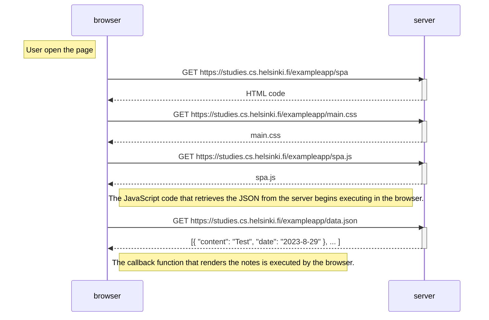

```mermaid
sequenceDiagram
    participant browser
    participant server
note left of browser: User open the page

browser->>server: GET  https://studies.cs.helsinki.fi/exampleapp/spa
   activate server
   server-->>browser: HTML code
   deactivate server

browser->>server: GET https://studies.cs.helsinki.fi/exampleapp/main.css
   activate server
   server-->>browser: main.css
   deactivate server

browser->>server: GET https://studies.cs.helsinki.fi/exampleapp/spa.js
    activate server
    server-->>browser: spa.js
    deactivate server
    
Note right of browser: The JavaScript code that retrieves the JSON from the server begins executing in the browser.
    
browser->>server: GET https://studies.cs.helsinki.fi/exampleapp/data.json
    activate server
    server-->>browser: [{ "content": "Test", "date": "2023-8-29" }, ... ]
    deactivate server
    
      Note right of browser: The callback function that renders the notes is executed by the browser.


```
