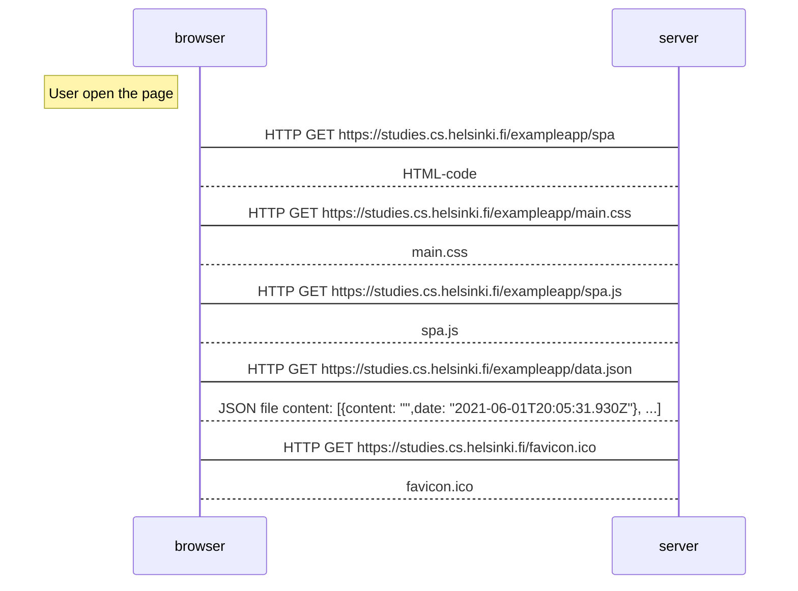

```mermaid
sequenceDiagram
    participant browser
    participant server
note left of browser: User open the page
    browser->server: HTTP GET https://studies.cs.helsinki.fi/exampleapp/spa
server-->browser: HTML-code
browser->server: HTTP GET https://studies.cs.helsinki.fi/exampleapp/main.css
server-->browser: main.css
browser->server: HTTP GET https://studies.cs.helsinki.fi/exampleapp/spa.js
server-->browser: spa.js
    

    browser->server: HTTP GET https://studies.cs.helsinki.fi/exampleapp/data.json
server-->browser: JSON file content: [{content: "",date: "2021-06-01T20:05:31.930Z"}, ...]
browser->server: HTTP GET https://studies.cs.helsinki.fi/favicon.ico
server-->browser: favicon.ico
    
```
